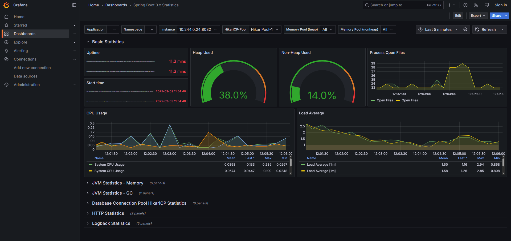
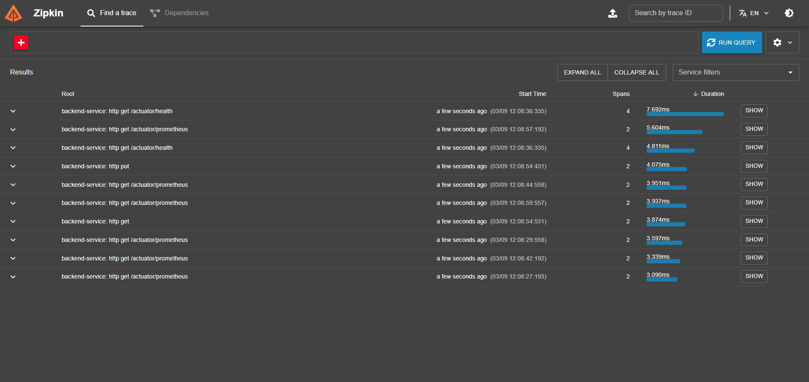

# Nikke Hub

Nikke Hub é um projeto pessoal de estudo feito com proposito de botar em pratica varios conceitos 
que aprendi na minha graduação em ciencias da computação.

Falando sobre o projeto, o intuiro dele é facilitar a visualização e acompanhamento dos personagens 
de um jogo gacha chamado **GODDESS OF VICTORY: NIKKE**, onde sera é possivel (porque eu ainda não fiz :p) 
adicionar os personagens a sua coleção e assim conseguir fazer as operações de atualizar os dados delas, 
leveis de skills, equipamentos e etc, e ainda não tem uma interface por enquanto. 

## Tecnologias Utilizadas

- **Linguagem**: Kotlin
- **Framework**: Spring Boot, Spring Cloud, Spring Data, Hibernate
- **Banco de dados**: PostgreSQL, MongoDB, Redis
- **Ferramentas**: Docker, Kubernetes, Zipkin, Prometheus, Grafana, OpenTelemetry

## Arquitetura

- **Client**: Quem vai consumir o sistema geralmente um Frontend, mas aqui esta sendo Curl e Postman
- **Ingress Nginx**: Um LoadBalancer que vai distribuir a cargar entre varios pods e unico ponto de entrada para o sistema no kubernetes
- **Gateway**: Responsavel por rotear para APIs e fornecer preocupações transversais a elas, como: segurança, monitoramento/métricas e resiliência
- **Service Discovery**: Serviço responsavel por registro de serviços, permitindo que um serviço conheça os outro dinamicamente
- **Config Server**: Serviço que armazena e distribui configuração para os serviços
- **OpenTelemetry Collector**: Coleta Tracing, Metricas e Logs dos serviços e distribui para as ferramentas necessarias para o processamento
- **Zipkin**: Ferramenta responsavel por fornecer os Traces e Spans emitidos por um serviço em tempo real
- **Prometheus**: Ferramenta responsavel por fornecer as Metricas de um serviço em tempo real
- **Grafana**: Plataforma para integrar ferramentas de metricas como Zipkin e Prometheus, para exibição do dados em dashboards

### Diagramas


## Observabilidade

### Grafana


### Zipkin


## Requisitos

```
Java 17
Kotlin 1.9.25
Spring 3.4.2
Spring Cloud 2024.0.0
Docker
Kubernetes
```

## Build

```bash
# Spring Cloud Netflix Eureka Server
git clone https://github.com/Hyuse98/Nikke-Hub-Service-Registry.git
```
```bash
# Spring Cloud Config Server
git clone https://github.com/Hyuse98/Nikke-Hub-Config-Server.git
```
```bash
# Nikke Hub Backend
git clone https://github.com/Hyuse98/Nikke-Hub-Backend.git
```
```bash
# Spring Cloud Gateway
git clone https://github.com/Hyuse98/Nikke-Hub-Gateway.git
```
```bash
# Fazer uma build limpa do projeto
./gradlew clean build
```
```bash
# Construir a imagem Docker
docker image build -t user/reponame:tag .
```
```bash
# Subir a imagem Docker para o Registry
docker image push user/reponame:tag
```

## Configuração

### variáveis de ambiente

As variaveis de ambiente estão sendo injetadas pelos manifestos kubernetes,
caso queira rodar localmente crie um arquivo .env na raiz e copie todas as variaveis dos manifestos

## Executando o Projeto

```bash
# Ir para o diretorio do kubernetes
cd k8s
```
```bash
# Adicionar as secrets
kubectl apply -f Secrets.yaml
```
```bash
# Iniciar o PostgreSQL
kubectl apply -f Postgres.yaml
```
```bash
# Iniciar o Redis
kubectl apply -f Redis.yaml
```
```bash
# Iniciar o Eureka Server
kubectl apply -f Eureka.yaml
```
```bash
# Iniciar o Config Server
kubectl apply -f Config.yaml
```
```bash
# Iniciar o Gateway
kubectl apply -f Gateway.yaml
```
```bash
# Iniciar o Otel Colector
kubectl apply -f Otel.yaml
```
```bash
# Iniciar o Ingress
kubectl apply -f Ingress.yaml
```
```bash
# Iniciar o Zipkin
kubectl apply -f Zipkin.yaml
```
```bash
# Iniciar o Prometheus
kubectl apply -f Prometheus.yaml
```
```bash
# Iniciar o Grafana
kubectl apply -f Grafana.yaml
```
```bash
# Esperar tudo estar pronto
# Iniciar o Backend
kubectl apply -f Backend.yaml
```

## Estrutura do Projeto

```
├── k8s/
    ┬── Backend.yaml                            # Backend Kubernetes Manifest
    ├── Postgres.yaml                           # Postgres Kubernetes Manifest
    ├── Redis.yaml                              # Redis Kubernetes Manifest
    └── Secrets.yaml                            # Secrets Kubernetes Manifest
├── src/
    ├── main/
        └── kotlin/...
            ┬── config/                         # Configurações
            ├── controller/                     # Controller Rest
            ├── dto/                            # Classes de Dados
            ├── enums                           # Classes de Enumeradores
            ├── exceptions                      # Classes de Exceções Custons
            ├── handler/                        # Classes de Manipulação de Exceções
            ├── model/                          # Classes Modelos e Entidades
            ├── repository/                     # Classes Responsaveis pela Persistencia
            ├── services/                       # Classes de Regras de Negocios
            └── NikkeManagerApplication.kt      # Arquivo principal
        └── resources/
            └── db/migration/                   # Diretorio das Migration Flyway 
                └── V0__A.sql                   # Arquivo Migration
                └── ...
            └── bootstrap.yaml                  # Arquivo de configuração Spring
    ├── test/                                   # Diretorio de Testes
    ├── build.gradle.kts                        # Gerenciador de dependencias
    └── Dockerfile                              # Arquivo docker para build de imagem
```

## Endpoints API

### Nikkes
- `POST /api/nikke`             - Cria uma nova nikke
- `GET /api/nikke`              - Lista todas as nikkes
- `GET /api/nikke/filtered`     - Lista todos as nikkes filtrados com parametros
- `GET /api/nikke/:name`        - Retorna uma nikke específica
- `PUT /api/nikke/:name`        - Atualiza dados de uma nikke
- `DELETE /api/nikke/:name`     - Remove uma nikke


### Dolls
- `POST /api/doll`              - Cria uma nova Doll
- `GET /api/doll`               - Lista todas as Dolls
- `GET /api/doll/search`        - Retorna uma Doll que corresponde aos parametros passados
- `GET /api/doll/:id`           - Retorna uma Doll dado o id
- `DELETE /api/doll/:id`        - Remove uma Doll


## Testes

Para executar os testes em CLI

Esta adicionado o plugin jacoco para exibir relatorio e acompanha a cobertura de teste que esta configurado para 80%
```bash
./gradlew test
```

## Licença

Este projeto está licenciado sob a [GNU General Public License v3.0](LICENSE.md).