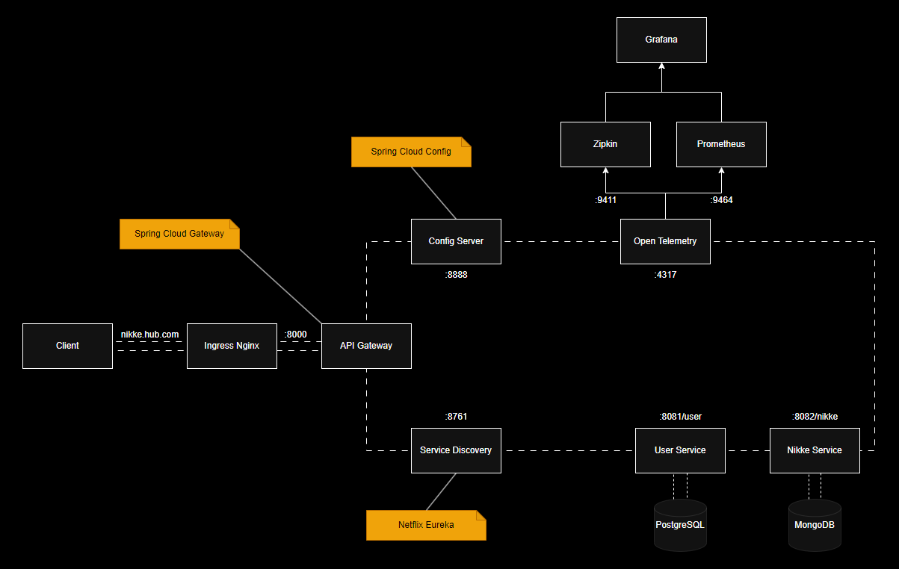

# Nikke Hub

Nikke Hub is a personal study project created with the purpose of putting into practice various concepts
that I learned during my degree in Computer Science, because that everything here is overengineering.

Speaking about the project, its goal is to facilitate the visualization and tracking of characters
from a gacha game called **GODDESS OF VICTORY: NIKKE**, where it will be possible (since I haven't done it yet :p)
to add characters to your collection and thus be able to perform operations to update their data,
skill levels, equipment, and so on. Currently, there is no user interface.

## Technologies Used

- **Language**: Kotlin
- **Framework**: Spring Boot, Spring Cloud, Spring Data, Hibernate
- **Database**: PostgreSQL, MongoDB, Redis
- **Tools**: Docker, Kubernetes, Zipkin, Prometheus, Grafana, OpenTelemetry

## Architecture

- **Client**: The system consumer, generally a frontend, but currently, it is Curl and Postman
- **Ingress Nginx**: A LoadBalancer that will distribute the load among several pods and serve as the single entry point for the system in Kubernetes
- **Gateway**: Responsible for routing to APIs and providing cross-cutting concerns such as security, monitoring/metrics, and resilience
- **Service Discovery**: Service responsible for service registration, allowing dynamic service-to-service communication
- **Config Server**: Service that stores and distributes configuration to other services
- **OpenTelemetry Collector**: Collects Tracing, Metrics, and Logs from services and distributes them to the necessary tools for processing
- **Zipkin**: Tool responsible for providing Traces and Spans emitted by a service in real-time
- **Prometheus**: Tool responsible for providing service metrics in real-time
- **Grafana**: Platform for integrating metric tools like Zipkin and Prometheus, displaying data in dashboards

### Diagrams


## Observability

### Grafana


### Zipkin


## Requirements

```
Java 17
Kotlin 1.9.25
Spring 3.4.2
Spring Cloud 2024.0.0
Docker
Kubernetes
OpenTelemetry Collector
```

## Build

```bash
# Spring Cloud Netflix Eureka Server
git clone https://github.com/Hyuse98/Nikke-Hub-Service-Registry.git
```
```bash
# Spring Cloud Config Server
git clone https://github.com/Hyuse98/Nikke-Hub-Config-Server.git
```
```bash
# Nikke Hub Backend
git clone https://github.com/Hyuse98/Nikke-Hub-Backend.git
```
```bash
# Spring Cloud Gateway
git clone https://github.com/Hyuse98/Nikke-Hub-Gateway.git
```
```bash
# Perform a clean build of the project
./gradlew clean build
```
```bash
# Build the Docker image
docker image build -t user/reponame:tag .
```
```bash
# Push the Docker image to the registry
docker image push user/reponame:tag
```

## Configuration

### Environment Variables

The environment variables are being injected by Kubernetes manifests.
If you want to run it locally, create a .env file at the root and copy all the variables from the manifests.

## Running the Project

```bash
# Navigate to the Kubernetes directory
cd k8s
```
```bash
# Add the Secrets
kubectl apply -f Secrets.yaml
```
```bash
# Start PostgreSQL
kubectl apply -f Postgres.yaml
```
```bash
# Start Redis
kubectl apply -f Redis.yaml
```
```bash
# Start Eureka Server
kubectl apply -f Eureka.yaml
```
```bash
# Start Config Server
kubectl apply -f Config.yaml
```
```bash
# Start Gateway
kubectl apply -f Gateway.yaml
```
```bash
# Start Otel Colector
kubectl apply -f Otel.yaml
```
```bash
# Start Ingress
kubectl apply -f Ingress.yaml
```
```bash
# Start Zipkin
kubectl apply -f Zipkin.yaml
```
```bash
# Start Prometheus
kubectl apply -f Prometheus.yaml
```
```bash
# Start Grafana
kubectl apply -f Grafana.yaml
```
```bash
# Wait until everything is ready
# Start the Backend
kubectl apply -f Backend.yaml
```

## Project Structure

```
├── k8s/
    ┬── Backend.yaml                            # Backend Kubernetes Manifest
    ├── Postgres.yaml                           # Postgres Kubernetes Manifest
    ├── Redis.yaml                              # Redis Kubernetes Manifest
    └── Secrets.yaml                            # Secrets Kubernetes Manifest
└── src/
    ├── main/
        └── kotlin/...
            ┬── config/                         # Configurations
            ├── controller/                     # Rest Controller
            ├── dto/                            # Data Classes
            ├── enums                           # Enums Classes
            ├── exceptions                      # Custom Exception Classes
            ├── handler/                        # Exception Handling Classes
            ├── model/                          # Model and Entity Classes
            ├── repository/                     # Persistence Classes
            ├── services/                       # Business Logic Classes
            └── NikkeManagerApplication.kt      # Main Application File
        └── resources/
            └── db/migration/                   # Flyway Migration Directory
                └── V0__A.sql                   # Migration File
                └── ...
            └── bootstrap.yaml                  # Spring Configuration File
    ├── test/                                   # Test Directory
    ├── build.gradle.kts                        # Dependency Manager
    └── Dockerfile                              # Docker Image Build File
```

## API Endpoints

### Nikkes

- `POST /api/nikke`             - Creates a new Nikke
- `GET /api/nikke`              - Lists all Nikkes
- `GET /api/nikke/filtered`     - Lists all Nikkes filtered by parameters
- `GET /api/nikke/:name`        - Returns a specific Nikke
- `PUT /api/nikke/:name`        - Updates a Nikke's data
- `DELETE /api/nikke/:name`     - Removes a Nikke


### Dolls

- `POST /api/doll`              - Creates a new Doll
- `GET /api/doll`               - Lists all Dolls
- `GET /api/doll/search`        - Returns a Doll matching the given parameters
- `GET /api/doll/:id`           - Returns a Doll by its ID
- `DELETE /api/doll/:id`        - Removes a Doll


## Testes

To run the tests via CLI

The JaCoCo plugin is added to generate reports and track test coverage, which is configured to 80%

```bash
./gradlew test
```

## Licença

This project is licensed under the [GNU General Public License v3.0](LICENSE.md).